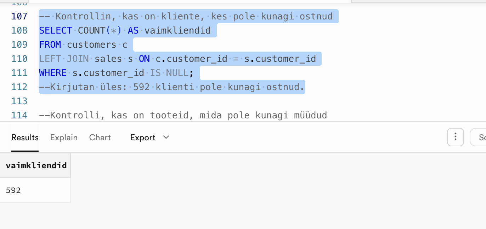

# Nädal 2: SQL Cleaning — UrbanStyle andmete uurimine

## 👤 Minu roll
Roll B — toote- ja müügiandmete puhastamine ning ristvalideerimine

## 🎯 Äriprobleem
Selle nädala fookuses oli UrbanStyle'i andmete puhastamine, kus pidime kõrvaldama kriitilised vead nagu üle 5000 duplikaatse müügirea, puuduvad kliendiandmed (NULL-väärtused) ja ebakorrektsed tuleviku kuupäevad.

## ⚙️ Lähenemine
Minu ülesanne oli toote- ja müügiandmete puhastamine ja ristvalideerimine (ROLL B). Kasutasin GROUP BY + HAVING, ROW_NUMBER(), IS NULL, COALESCE() ja NULLIF(), CAST, TRIM(), UPPER()/LOWER() ja kuupäevafunktsioone.

## 🔍 Peamised Leiud
- Kogumüük kõige kõrgem Tallinnas (1 062 520€)
- Hõbeda tasemel kliente 560
- 1 024 klienti ei ole üheski lojaalsusprogrammi tasemes
- 2 müügikanalit: online (1 006 747€) ja pood (1 902 430€)
- Online poe osakaal on suurem kõrgema elanikkonnaga piirkondades
- Füüsilised poed toovad enim müüki sisse kõigis linnades

## 💼 Äriline soovitus
1 024 klienti ilma lojaalsustasemeta on kasutamata potentsiaal — soovitan need automaatselt baastasemele liita ja jälgida konversiooni. Kuna füüsiline pood domineerib kõigis linnades, kuid online kasvab kõrgema elanikkonnaga piirkondades, tasub online-turundust just neis linnades tugevdada, mitte hajutada eelarvet ühtlaselt üle kõigi asukohtade.

## 🛠️ Tehniline Pinurida
SQL (PostgreSQL/Supabase)

## 📸 Ekraanipildid

## ▶️ Kuidas Käivitada
SQL päringud käivitatavad otse andmebaasi konsoolis (fail: `week2_customers_crossvalidation_cleaning.sql`)

## 💡 Õpitu ja Väljakutsed
Õppisin sellel nädalal andmete puhastamist ja ristvalideerimist.

## 🤖 AI kasutamine
Kasutasin AI-d (NotebookLM), et kiiresti leida ja mõista spetsiifilisi SQL-i funktsioone. AI aitas mul SQL päringuid õigeks muuta ja genereerida kontrollpäringuid, mis tagasid, et muudatused test-tabelites olid korrektsed.

## 👥 Meeskonna töö
https://docs.google.com/presentation/d/1aXbHz_prwYMUp1iP37YYKQh6YgeExWUGKPCPc3-hlUU/edit?slide=id.g3e1805e3309_1_0#slide=id.g3e1805e3309_1_0

## 📁 Failid
- `week2_customers_crossvalidation_cleaning.sql` — minu SQL päringud
- `week2resultsscreenshot.png` — tulemuste pilt
