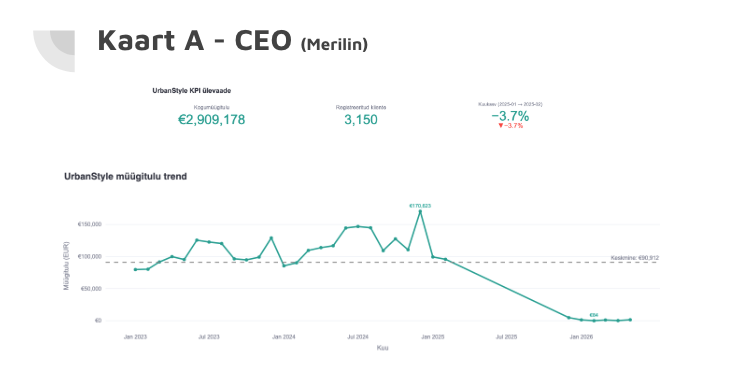
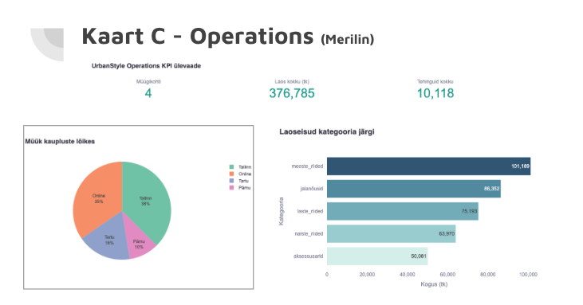

# Nädal 5: Visualiseerimise disain — CEO ja Operations dashboardid

## 👤 Minu roll
Kaart A — CEO Dashboard, Kaart C — Operations Dashboard (Kaart B, Marketing, oli tiimikaaslase Kairi töö)

## 🎯 Äriprobleem
CEO Kristi vajas kiiret kõrgtaseme ülevaadet, kas ettevõte kasvab. Operatsioonijuht Liisi vajas ülevaadet laoseisudest ja müügist kaupluste kaupa, et teha täiendamisotsuseid.

## ⚙️ Lähenemine
Ehitasin kaks Streamlit + Plotly dashboard'i. Kasutasin `go.Indicator` subplots KPI kaartideks, joondiagrammi müügitulu trendiks (koos keskmise joone ja min/max annotatsioonidega), sektordiagrammi müügi jaotuseks kaupluste lõikes ja horisontaalset tulpdiagrammi laoseisude jaoks kategooria kaupa. Kuukasvu (MoM) arvutasin ainult kuudel, kus käive ületas 5000€, et vältida moonutust poolikutest andmetest. Andmed laaditi Supabase'ist `data_loader.py` kaudu, cache'iti 5 minutiks.

## 🔍 Peamised Leiud
- CEO dashboard: kogumüügitulu €2 909 178, 3 150 registreeritud klienti, kuukasv (2025-01 → 2025-02) −3.7%, keskmine kuukäive €90 912, tipp €170 623
- Trendigraafik näitab käibe järsu languse alates 2025. keskpaigast kuni peaaegu nullini (€84) 2026 alguseks — kattub week-1 leiuga vigastest tulevikukuupäevadest andmestikus
- Operations dashboard: 4 müügikohta, 376 785 tk laos, 10 118 tehingut kokku
- Müük kaupluste lõikes: Tallinn 38%, Online 35%, Tartu 18%, Pärnu 10%
- Laoseis kategooriate kaupa: meeste_riided suurim (101 189 tk), aksessuaarid väikseim (50 081 tk)

## 💼 Äriline soovitus
Enne CEO-le esitamist tuleks andmestikust eemaldada või selgelt märgistada poolikud/tulevikukuupäevaga read — muidu tekib juhtkonnal eksitav mulje käibe kokkuvarisemisest, kuigi tegu on andmekvaliteedi probleemiga. Lisaks tasub kontrollida, kas aksessuaaride madalaim laovaru peegeldab reaalset madalamat nõudlust või tarneahela kitsaskohta.

## 🛠️ Tehniline Pinurida
Python, Streamlit, Plotly, pandas, Supabase

## 📸 Ekraanipildid




## ▶️ Kuidas Käivitada
```bash
pip install streamlit pandas plotly supabase python-dotenv
# lisa .env fail SUPABASE_URL ja SUPABASE_KEY väärtustega
streamlit run ceo_dashboard.py        # Kaart A
streamlit run operations_dashboard.py # Kaart C
```

## 💡 Õpitu ja Väljakutsed
Kujundasin KPI-dashboard'i Streamlit ja Python abil, valisin juhtkonna jaoks olulisemad mõõdikud, analüüsisin müügi-, kliendi- ja müügikanalite andmeid ning koostasin andmeloo (data storytelling) koos äriliste soovitustega.

## 🤖 AI kasutamine
Kasutasin ChatGPT-d, et aidata kujundada dashboard'i ülesehitust, leida sobivaid koodilahendusi ning sõnastada ärilisi järeldusi ja juhtkonnale mõeldud soovitusi.

## 👥 Meeskonna töö
https://docs.google.com/presentation/d/15zFRATbCiVEX8vO5tqRciM-NlO0ze_nxJ7jCX3v5Iok/edit?slide=id.g3ed3ff4dc7b_0_268#slide=id.g3ed3ff4dc7b_0_268

## 📁 Failid
- `ceo_dashboard.py` — minu Kaart A dashboard
- `operations_dashboard.py` — minu Kaart C dashboard
- `data_loader.py` — jagatud andmelaadimise moodul
- `app.py` — tiimikaaslase Kaart B (Marketing)
